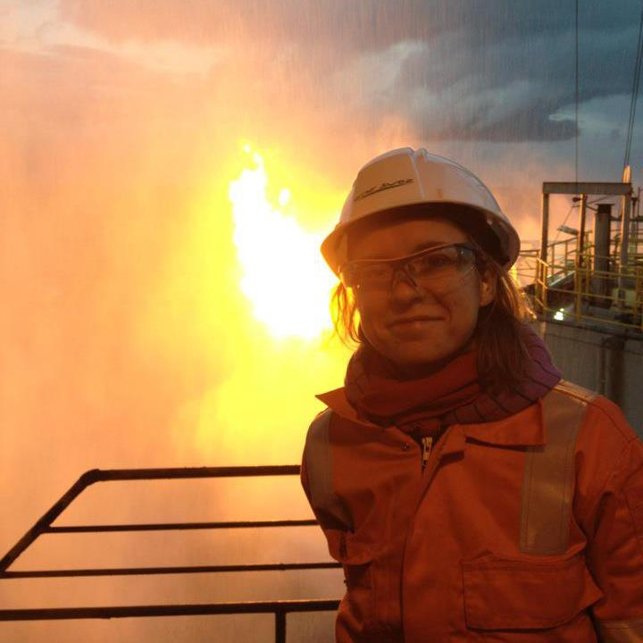
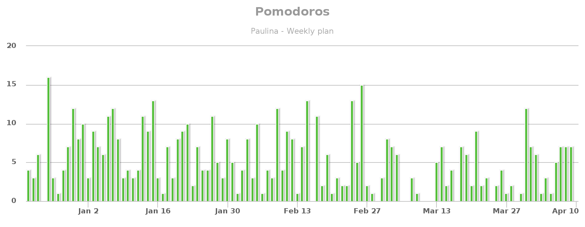

Career change between unrelated industries can seem like an impossible task for many. It's not an endeavor that majority would pursue, but with the increased use of automation and AI, many might be forced to reskill and change their career path. Of course, it is scary, and your success is not guaranteed. The amount of research, planning, and actual work to be able to switch industries can be enormous, and fear of failure freezes many people before they even begin to explore possible options. As a result, more and more people stay in careers that don't bring them fulfillment or lead overtime to lack of job opportunities and layoffs. It doesn't have to be this way. My journey of switching from Oil&Gas to software development can be an example that with the right plan and commitment success can be achieved.

### Reasons for my career switch

There can be many reasons why people decide to switch career. Some have discovered passion in other domain; others were laid off and had to find a new job or didn't see much prospects for the growth of their industries. For me, it was a combination of factors. I worked in the Oil&Gas industry for around eight years. As for my background, I majored in Geological Engineering at the University of Bucharest. Most of my experience I gained by working in the Well Operations team. The position included often trips to drilling rigs and production platforms to supervise various operations. I liked my job a lot and enjoyed the technical work I was doing. Unfortunately, starting in 2015, the oil and gas industry has adapted to a lower activity level after several years of steady growth. The employment rate and opportunities for development significantly decreased. I was being driven insane by the monotony of the daily work and lack of exciting offshore projects. At that point, I realized that a career switch would be the key to regain fulfillment and enthusiasm in my day to day work. I decided to develop new skills to let me have a more exciting and future-proof job. I planned to learn programming, data analytics, and machine learning and apply the knowledge at my current job. I did optimize certain activities for myself but never got sufficient support to develop something more significant. Although initially, I planned to develop data analytics and machine learning skills to apply them in the Oil&Gas (automate processes and perform predictions on the data sets) I realized that I was ahead of my time. The possibilities of finding a job in the Oil&Gas as data analytics engineer in the Netherlands (where I lived) were non-existent. I have decided not to give up and continued to learn to program. I changed my focus to web development, as there were more opportunities. It took me another year of countless hours of studying before I started to work as a full-time software developer.

### Oil&Gas vs. Programmer Mindset

Many may wonder if the Oil&Gas skills can be in any way transferable into the software engineering domain. After all, for most of the people working in the Oil&Gas idea of writing code seems as foreign as drilling operation for the software developer. But why is that? Aren't they eating complex engineering problems for breakfast? Yes, and they do it well. Oil&Gas engineers love to solve challenging technical issues and collaborate with other members of the multi-disciplinary team. They are detail-oriented, have laser focus, work well under high pressure, and have a Ph.D. in teamwork. I do believe that the mindset of Oil&Gas engineers has a lot in common with the mindset of programmers. I know that all the skills gathered during my career as an Oil&Gas engineer are helping me tremendously in my current quest to become a proficient programmer. You don't have to think of a career switch as of complete abandonment of your previous experience. You can always find overlap and have a competitive edge.

### Career change action plan and execution

If you want to achieve your goals successfully, adequate preparation is vital. Having done research and planning, goal setting, and execution roadmap will make a big difference to your results, jumping into things without having a clear picture of what it means and having clear WHY will only bring frustration. For me, planning, preparation, and execution roadmap are keys to increasing chances of achieving the desired goal. I want to share how my process of career change looked like to like. I do hope it will inspire you and help you on your journey.

#### Planning

When I decided to start my transition into software development, I didn't just start watching random tutorials online but created an exact studying plan. I spent a significant amount of time researching programming learning paths, various courses, and bootcamps. I was ready to invest not only time but also money in my education. Since at that time, I was working as Well Operations Engineer for a major operator in the Netherlands, I decided to develop data analytics skills to be able to apply them to my current job. Although at work, we had access to quite sophisticated software, a lot of data preparation and transformation we performed manually (usually really manually or with the help of excel). I was interested in automatizing processes, implemented continuous improvement as well as using machine learning for predictive maintenance. Keeping that in mind, I have decided to enroll in [Udacity Data Analyst Nanodegree](https://eu.udacity.com/course/data-analyst-nanodegree--nd002). I read lots of reviews about this Nanodegree and concluded that it would be the right course for me. As I mentioned after completion of Udacity Data Analyst Nanodegree, I switch to Full-Stack JavaScript Development, but for each next step on my career transition, I applied a similar planning process.

<figure>
    <blockquote>
        
 "My formula for success?... Rise early. Work late. Strike  oil."
        <footer>
            <cite>-  J.Paul Getty Coaster (British American petrol-industrialist)</cite>
        </footer>
    </blockquote>
</figure>

#### Execution

Although now the program is broken in two parts when I enrolled the estimated completion time of the Nanodegree was one year. I have decided to aim at 25 hours a week of deep work to complete this program. That resulted in around 3h of studying (after my full-time job) during the weekdays and 10 hours on weekends. I planned my work using [Kanban Flow](https://kanbanflow.com) and keep count of time spent on each task. Most of the time, I executed or overperformed. Below you can find an image of my Pomodoro statistics.

You may decide to have less intense learning schedule. That's fine. Regardless if you study 10,15 or 25 hours a week, you will need to stay focus and avoid distractions. Remember that the long-term goal requires long-term work. Every hour of your studying, every completed project, and short-term goals that you tackle need to lead toward your main objective. Learning programming will be very hard at times. You will feel like you can't understand anything and that it's not for you. In those moments don't count on motivation. **Count on Discipline**. Make sure that you will stick to the previously crafted plan. The studing will be very tiring so make sure you take regual rest to help you brain reboot.

### Conculsions

Getting a job as a software developer will not walk in the park. You will have to stay super focus and committed to your goal. I believe that if you already have a technical background, you will have an easier time going through the whole process. Of course, being a good developer and getting a good job, that's a whole another story. I would highly recommend to all Oil&Gas professional to start learning how to code. Even if you don't want to follow my path, coding skills will help you tremendously in your current work and career in general. Especially learning Python might be beneficial. I believe that in 5 years everybody will be expected to know to program basic in one of the commonly used languages. I hope you got some useful information out of the post. If you decide to start your coding journey, keep in mind that it's going to be hard, but if you put yourself up for success by proper planning and diligent execution you will be able to achieve anything you want.
