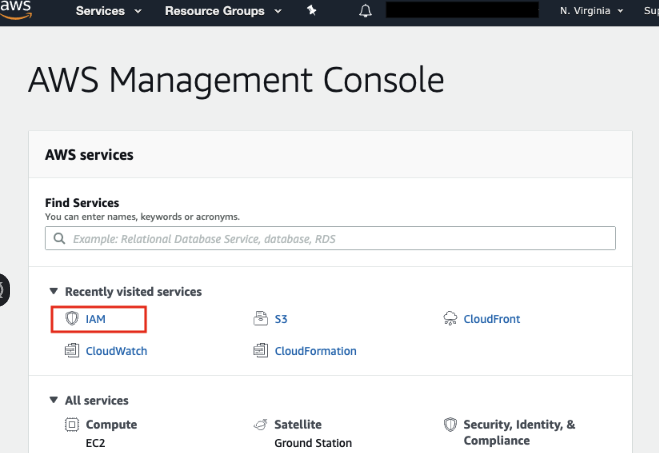
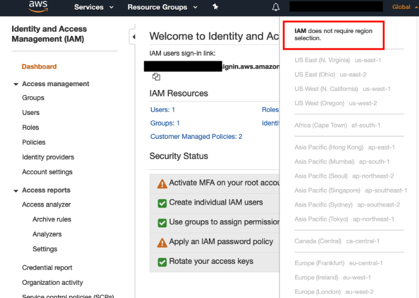
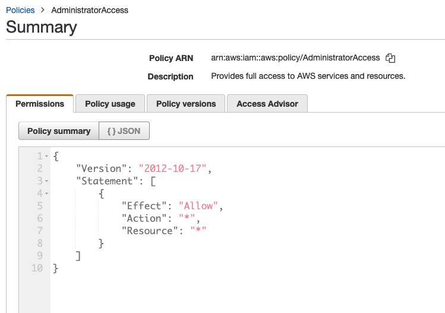
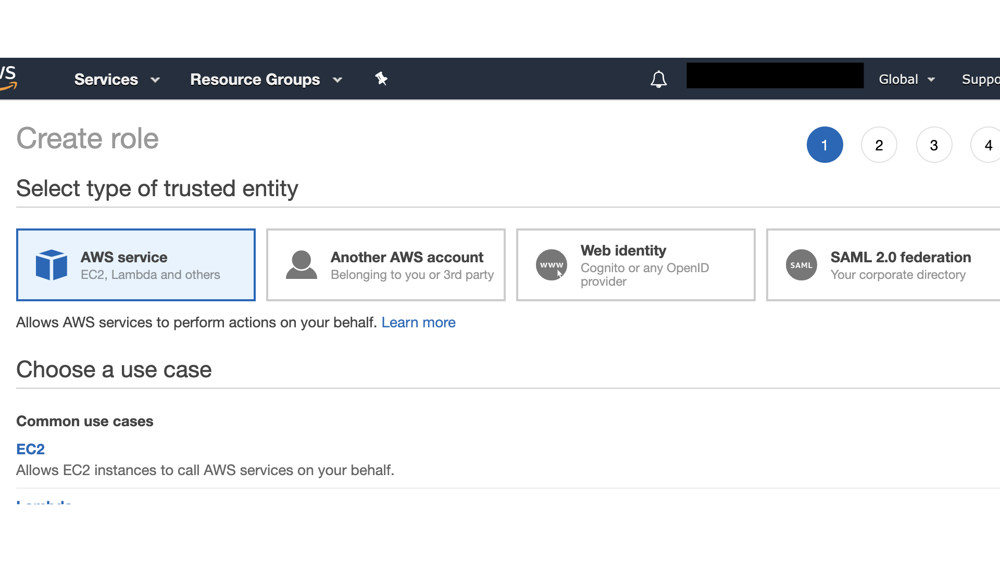

## Overview

AWS Identity and Access Management (IAM) enables you to manage access to AWS services and resources. It allows you ro create Groups. IAM allows you to create create and manage AWS users and groups, and use permissions to allow and deny their access to AWS resources. It can be accessed through AWS Console, using SDKs or programatically.

| 
*IAM in AWS Console*

IAM is a feature of your AWS account offered at no additional charge. You will be charged only for use of other AWS services by your users.
The common use of IAM is to manage:
- Users,
- Groups,
- Roles,
- IAM Access Policies,
- API Keys,
- password policies and MFA.

IAM is a global to all AWS regions. If you create a e.g User in IAM it will be accessible in all Regions.

*IAM is a global service and doesn't require region selection.*

Before we dive in into Identity And Access Managment let's clarify difference between Authentification, Authorization and Access Control.

__Authentification__ it is a process of defining an identity and verification of that identity.

__Authorization__ determines what an identity can access within a system once it's authentificated.

__Access Control__ is a method and process of how access is granted to a secure resource.

## Root User

When you create a new AWS account, the only user that will be created by default is a root user. It's recommended to follow AWS best pracices and complete following steps once you create a new AWS account:
- Delete root access keys
- Activate MFA on your root account
- Create individual users
- Assign Users to groups
- Add permissions to the groups
- Update an IAM password policy.

__Note:__ You should not peform your daily admin work using root user. The best practice is to create an admin user for this and use root account only for emergencies.

## Principle of Least Privigle

When you create IAM policies, it's recommended grant least privilege, or granting only the permissions required to perform a task for your users. You need to determine what at users (and roles) need to do and then design the policies that allow them to perform __ONLY__ those tasks.

## IAM Policies
A policy is a document that formally states one or more permissions and can be attached to a User, Group or Role. Polices can't be directly attached to AWS resources -  you need to do this using Roles.You can add one or more policies to an User, Group or an Role.

Poliecies are written in json format and include Statement, Effect and Action. Statement is a main element of the policy and includes all the defined permissions in it. Effect is an permission which can be set to 'Allow' or 'Deny'. Actions refers to API cal to AWS services to whixh authentification is done using IAM e.g "Action":ListBucket. To add multiple actions in one policy statement simply separate them using commas e.g "Action:s3:DeleteBucket", "s3:CreateBucket", "s3:ListBucket" etc.

There ate two types of IAM policies: Managed Policies and In-line Policies.
Policies are preconfigured by AWS and cover most of the commonly required permissions.
Policies in IAM take effect immediately.

Managed Policies can be split in AWS Managed and Customer Managed policies. AWS Managed policies are pre-built policies templates e.g Admin Access (gives full access to all AWS Resources).

Customer Managed Policies are created and managed by you. You can create them using the policuy generator or write them from scratch,

*IAM is a global service and doesn't require region selection.*

## Users

When a new user is created in an AWS account, it is given NO acces to any of the AWS services. This is called __non-explicit deny__ rule that is set on all newly created IAM users. For all users (except the root user), permissions must be granted in order for them to be able to access any AWS service.

We can add a user to a Group.

Users can be created via AWS Management Console or programmatically:

- aws command line interface
- tools for win powershell
- IAM HTTP API
IAM users receive unique access credentials which should not be shared with other users.
It's possible to configure MFA on per user basis for login and access to the resources.

Note: Users credentials should neber be stored or passed to an EC2 instance.

## Groups

## Roles

objects that different identities can adopt to assume a new set of permissions. Roles don't have any access key or credentials associated with them. The credentials are dynamically assigned.

IAM role is similar to an IAM user in that you can manage its access to AWS resources using policies. IAM roles are attachable to other IAM services like AWS EC2 and AWS Lambda, to manage resource access for those services. In this Lab Step, you will practice creating an IAM role.

When creating a role you can select type of trusted identity: AWS Service (e.g EC2, Lambda etc.), Another AWS Account (for fors account access), Web Identity (using Cognito or OpenID provider) or SAML 2.0 federation.

*Create Role in AWS IAM using AWS Comsole.*

For more on Role creation, check out [AWS documentation](https://docs.aws.amazon.com/IAM/latest/UserGuide/id_roles_create.html).

## Web Identity Federation

- users can access to AWS resources after they have successfully authenticated with web-based identity provided by Amazon, Google.
- Following successful authentication the user receives an authentication code from the web ID provider, which they can trade for temporary AWS security credentials.

**User Pools** - user directories used to manage sign-up and sign-in functionality for mobile and web apps. Users can sign-in directly to the User Pool or indirectly by identity provider e.g Facebook. Cognito acts as an Identity Broker between the ID provider and AWS. Successfulz authentication generates a number of JWTs.

**Identity Pools** - enable you to create unique identities for your users and authenticate them with identity providers. With an identity, you can obtain temporaty, limited-privilege AWS credentials to access other AWS services.

## Cross Account Access
Often AWS customer use multiple AWS acconts e.g separate accounts for development and production resources. In order to manage effectively multiple account you can use cross account access. It allows you to easily switched roles thus log in in different AWS accounts from AWS Managment COnsole.

## IAM Best Practices
When you create a new AWS account, the only user that will be created by default is a root user.

## IAM Limits
- User can be associated max to 10 groups.

## References
- [AWS Global Infrastructure](https://aws.amazon.com/about-aws/global-infrastructure/)
