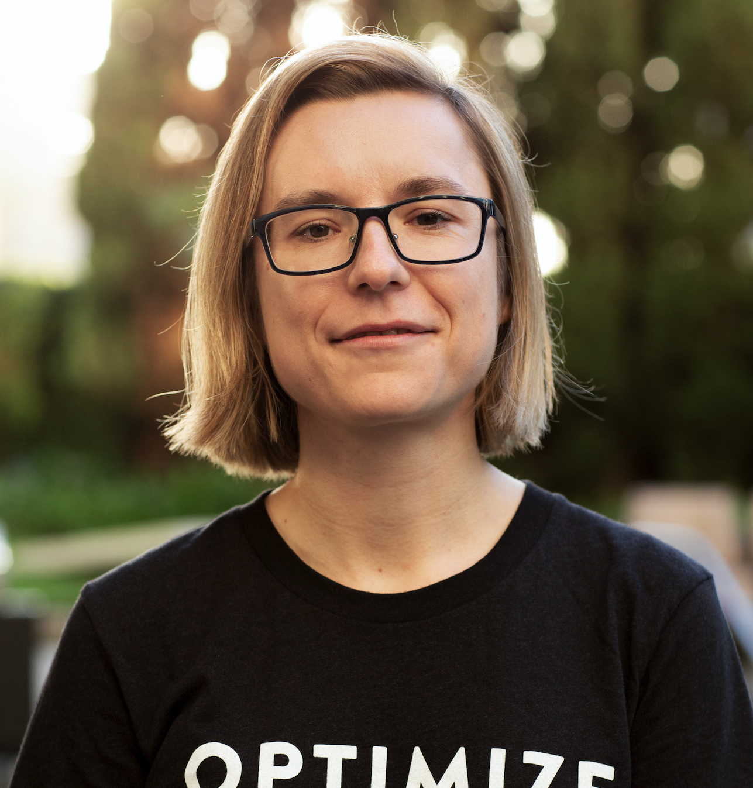

## Howdy 🤠

### I'm Paulina Grunwald.

I am a software engineer 👩🏻‍💻 from Poland 🇵🇱 living in the Netherlands 🇳🇱. After working in Oil&Gas for about 8 years I have switched my career to web development.

Coding and sharing with others are my passion. I love learning new things and tinkering with different technologies and frameworks.

  I'm a Lead Developer at <a style="padding-left: 5px;"href="https://www.optimize.me/">OPTIMIZE</a>.
    
  

<!--

   Nowadays I work as a Lead Developer at <a href="https://www.optimize.me.com/">Optimize.me</a>.
  
  
    

  </spam>

  
  
I'm a Developer Advocate at <a href="https://www.apollographql.com/">Apollo GraphQL</a>. 

 -->
